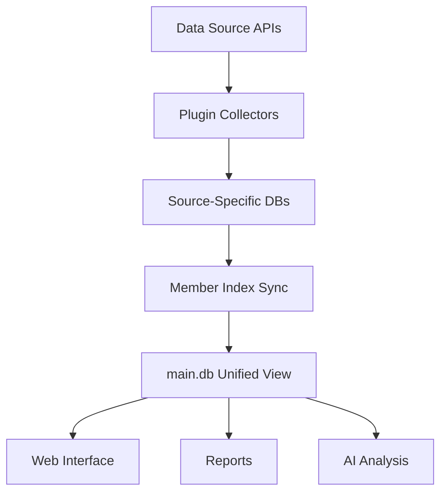

# All-Thing-Eye Data Guide for AI & Non-Developers

**Last Updated**: 2025-11-12  
**Version**: 1.0.0  
**Purpose**: Enable non-technical users and AI assistants to understand and extract data from All-Thing-Eye system

---

## 📋 Table of Contents

1. [Overview](#overview)
2. [Database Architecture](#database-architecture)
3. [Data Collection Workflow](#data-collection-workflow)
4. [Database Schemas](#database-schemas)
5. [Common Data Queries](#common-data-queries)
6. [Data Export Methods](#data-export-methods)
7. [AI Prompt Examples](#ai-prompt-examples)
8. [Troubleshooting](#troubleshooting)

---

## 🎯 Overview

### What is All-Thing-Eye?

All-Thing-Eye is a team activity tracking and analytics system that collects data from multiple sources:

```
┌─────────────────────────────────────────────────────────────┐
│                     All-Thing-Eye System                    │
├─────────────────────────────────────────────────────────────┤
│                                                             │
│  Data Sources:                                              │
│  ┌─────────┐  ┌─────────┐  ┌──────────┐  ┌──────────┐    │
│  │ GitHub  │  │  Slack  │  │  Google  │  │  Notion  │    │
│  │         │  │         │  │  Drive   │  │          │    │
│  └────┬────┘  └────┬────┘  └────┬─────┘  └────┬─────┘    │
│       │            │            │             │           │
│       └────────────┴────────────┴─────────────┘           │
│                          │                                 │
│                    ┌─────▼──────┐                         │
│                    │  Main DB   │                         │
│                    │ (Unified)  │                         │
│                    └────────────┘                         │
│                                                             │
│  Output:                                                    │
│  • Web Dashboard                                            │
│  • CSV/JSON Exports                                         │
│  • Weekly Reports                                           │
│  • AI Analysis                                              │
└─────────────────────────────────────────────────────────────┘
```

### Key Concepts

| Term                  | Description                    | Example                                      |
| --------------------- | ------------------------------ | -------------------------------------------- |
| **Member**            | Team member being tracked      | "Jake", "Monica", "Jason"                    |
| **Activity**          | Any trackable action           | GitHub commit, Slack message, Notion edit    |
| **Source**            | Platform where activity occurs | GitHub, Slack, Google Drive, Notion          |
| **Channel**           | Slack conversation space       | #project-ooo, #project-eco                   |
| **Project**           | Group of related activities    | project-ooo (ZK Proof project)               |
| **Collection Period** | Time range for data gathering  | Last week: Friday 00:00 ~ Thursday 23:59 KST |

---

## 🏗 Database Architecture

### Multi-Database Structure

All-Thing-Eye uses **one main database** + **one database per data source**:

```
data/databases/
├── main.db           ← Member index + Unified activities
├── github.db         ← GitHub commits, PRs, issues
├── slack.db          ← Slack messages, reactions, links
├── google_drive.db   ← Drive file activities
└── notion.db         ← Notion page edits, comments
```

### Why Multiple Databases?

| Benefit         | Explanation                                                  |
| --------------- | ------------------------------------------------------------ |
| **Modularity**  | Each data source can be updated independently                |
| **Performance** | Queries don't scan irrelevant data                           |
| **Flexibility** | Easy to add new data sources without affecting existing ones |
| **Backup**      | Can backup specific sources separately                       |

### Data Flow



**Step-by-step:**

1. **Collect**: Plugins fetch data from APIs (GitHub, Slack, etc.)
2. **Store**: Raw data stored in source-specific databases
3. **Normalize**: Member names/IDs mapped to unified identifiers
4. **Unify**: Key activities copied to `main.db` for cross-source analysis
5. **Export**: Data available via web UI, CSV, JSON, or SQL queries

---

## 📊 Data Collection Workflow

### Weekly Collection Cycle

```
┌─────────────────────────────────────────────────────────┐
│         Weekly Data Collection (Friday - Thursday)      │
└─────────────────────────────────────────────────────────┘

Week Definition:
  Start: Friday 00:00:00 KST
  End:   Thursday 23:59:59 KST

Example: Week 2025-10-31
  Period: 2025-10-31 (Fri) ~ 2025-11-06 (Thu)

Collection Commands:
  GitHub:       python tests/test_github_plugin.py --last-week
  Slack:        python tests/test_slack_plugin.py --last-week
  Google Drive: python tests/test_google_drive_plugin.py --days 7
  Notion:       python tests/test_notion_plugin.py --days 7
```

### Collection Process

```
┌──────────────────────────────────────────────────────┐
│ Step 1: Authenticate                                 │
│  • Verify API tokens                                 │
│  • Check permissions                                 │
└──────────────────────────────────────────────────────┘
                    ▼
┌──────────────────────────────────────────────────────┐
│ Step 2: Fetch Data                                   │
│  • Query API for date range                          │
│  • Filter by project/channel                         │
│  • Extract metadata (who, what, when)                │
└──────────────────────────────────────────────────────┘
                    ▼
┌──────────────────────────────────────────────────────┐
│ Step 3: Process & Store                              │
│  • Parse API responses                               │
│  • Extract links, files, reactions                   │
│  • Store in source-specific DB                       │
└──────────────────────────────────────────────────────┘
                    ▼
┌──────────────────────────────────────────────────────┐
│ Step 4: Member Mapping                               │
│  • Match GitHub username → Member name               │
│  • Match Slack user ID → Member name                 │
│  • Match email → Member name                         │
└──────────────────────────────────────────────────────┘
                    ▼
┌──────────────────────────────────────────────────────┐
│ Step 5: Sync to Main DB                              │
│  • Create unified activity records                   │
│  • Add to member_activities table                    │
│  • Prevent duplicates via activity_id                │
└──────────────────────────────────────────────────────┘
```

---

## 📚 Database Schemas

### Main Database (`main.db`)

#### Table: `members`

**Purpose**: Team member registry

| Column       | Type      | Description                        | Example                |
| ------------ | --------- | ---------------------------------- | ---------------------- |
| `id`         | INTEGER   | Unique member ID                   | 1                      |
| `name`       | TEXT      | Member's name (primary identifier) | "Jake"                 |
| `email`      | TEXT      | Email address                      | "jake@tokamak.network" |
| `created_at` | TIMESTAMP | Registration time                  | "2025-11-01 10:00:00"  |

**Sample Data:**

```sql
id | name   | email                  | created_at
---+--------+------------------------+-------------------
1  | Jake   | jake@tokamak.network   | 2025-11-01 10:00:00
2  | Monica | monica@tokamak.network | 2025-11-02 14:30:00
3  | Jason  | jason@tokamak.network  | 2025-11-01 10:00:00
```

#### Table: `member_identifiers`

**Purpose**: Map external platform IDs to members

| Column           | Type      | Description            | Example                     |
| ---------------- | --------- | ---------------------- | --------------------------- |
| `id`             | INTEGER   | Record ID              | 1                           |
| `member_id`      | INTEGER   | Foreign key to members | 1 (→ Jake)                  |
| `source_type`    | TEXT      | Platform name          | "github", "slack", "notion" |
| `source_user_id` | TEXT      | Platform-specific ID   | "U06NU86J75M" (Slack)       |
| `created_at`     | TIMESTAMP | Mapping creation time  | "2025-11-01 10:00:00"       |

**Sample Data:**

```sql
id | member_id | source_type | source_user_id     | created_at
---+-----------+-------------+--------------------+-------------------
1  | 1         | github      | JakeJang           | 2025-11-01 10:00:00
2  | 1         | slack       | u06nu86j75m        | 2025-11-01 10:00:00
3  | 1         | notion      | jake@tokamak.network | 2025-11-01 10:00:00
4  | 2         | slack       | u05p80dnbs5        | 2025-11-02 14:30:00
```

**How It Works:**

- Jake has 3 identities across platforms
- All activities from these IDs are attributed to member_id=1 (Jake)

#### Table: `member_activities`

**Purpose**: Unified view of all member activities

| Column          | Type      | Description                | Example                             |
| --------------- | --------- | -------------------------- | ----------------------------------- |
| `id`            | INTEGER   | Record ID                  | 1                                   |
| `member_id`     | INTEGER   | Foreign key to members     | 1 (→ Jake)                          |
| `source_type`   | TEXT      | Platform name              | "github", "slack"                   |
| `activity_type` | TEXT      | Type of action             | "commit", "message", "page_created" |
| `timestamp`     | TIMESTAMP | When it happened (UTC)     | "2025-11-06 05:30:00"               |
| `metadata`      | JSON TEXT | Additional details         | `{"repository": "Tokamak-zk-EVM"}`  |
| `activity_id`   | TEXT      | Unique activity identifier | "github:commit:abc123def"           |
| `created_at`    | TIMESTAMP | Record creation time       | "2025-11-07 02:00:00"               |

**Activity Types by Source:**

| Source           | Activity Types                                                     |
| ---------------- | ------------------------------------------------------------------ |
| **GitHub**       | `github_commit`, `github_pull_request`, `github_issue`             |
| **Slack**        | `message`, `reaction`                                              |
| **Google Drive** | `created`, `edited`, `viewed`, `shared`                            |
| **Notion**       | `page_created`, `page_edited`, `comment_added`, `database_created` |

**Sample Data:**

```sql
id | member_id | source_type | activity_type | timestamp           | metadata
---+-----------+-------------+---------------+---------------------+------------------
1  | 1         | github      | commit        | 2025-11-06 05:30:00 | {"repository":"Tokamak-zk-EVM","sha":"abc123"}
2  | 1         | slack       | message       | 2025-11-06 13:24:08 | {"channel_id":"C07JN9XR570","text_length":45}
3  | 2         | slack       | message       | 2025-11-05 10:15:30 | {"channel_id":"C07JN9XR570","has_links":true}
```

---

### GitHub Database (`github.db`)

#### Table: `github_commits`

**Purpose**: Code commit history

| Column            | Type      | Description        | Example                    |
| ----------------- | --------- | ------------------ | -------------------------- |
| `sha`             | TEXT      | Unique commit hash | "abc123def456..."          |
| `repository_name` | TEXT      | Repo name          | "Tokamak-zk-EVM"           |
| `author_login`    | TEXT      | GitHub username    | "JakeJang"                 |
| `message`         | TEXT      | Commit message     | "fix: resolve memory leak" |
| `committed_at`    | TIMESTAMP | Commit time        | "2025-11-06 05:30:00"      |
| `additions`       | INTEGER   | Lines added        | 45                         |
| `deletions`       | INTEGER   | Lines deleted      | 12                         |
| `url`             | TEXT      | GitHub URL         | "https://github.com/..."   |

**What You Can Learn:**

- Who committed code and when
- How much code was added/removed
- Which repositories are most active
- Commit message patterns

#### Table: `github_pull_requests`

**Purpose**: Pull request (code review) history

| Column            | Type      | Description                 | Example                           |
| ----------------- | --------- | --------------------------- | --------------------------------- |
| `number`          | INTEGER   | PR number                   | 131                               |
| `repository_name` | TEXT      | Repo name                   | "Tokamak-zk-EVM"                  |
| `title`           | TEXT      | PR title                    | "Implement WASM verifier"         |
| `state`           | TEXT      | Current status              | "merged", "open", "closed"        |
| `author_login`    | TEXT      | Who created it              | "JakeJang"                        |
| `created_at`      | TIMESTAMP | PR creation time            | "2025-11-05 10:00:00"             |
| `merged_at`       | TIMESTAMP | When merged (if applicable) | "2025-11-06 14:30:00"             |
| `url`             | TEXT      | GitHub URL                  | "https://github.com/.../pull/131" |

**What You Can Learn:**

- Code review activity
- Time from PR creation to merge
- Who reviews whose code
- Project velocity

---

### Slack Database (`slack.db`)

#### Table: `slack_messages`

**Purpose**: Slack conversation history

| Column       | Type      | Description                   | Example                                |
| ------------ | --------- | ----------------------------- | -------------------------------------- |
| `ts`         | TEXT      | Message timestamp (unique ID) | "1699286078.537699"                    |
| `channel_id` | TEXT      | Channel ID                    | "C07JN9XR570"                          |
| `user_id`    | TEXT      | Slack user ID                 | "u06nu86j75m"                          |
| `text`       | TEXT      | Message content               | "Let's focus on ZK proof optimization" |
| `posted_at`  | TIMESTAMP | When sent (UTC)               | "2025-11-06 13:24:08"                  |
| `thread_ts`  | TEXT      | Thread parent (if reply)      | "1699286078.537699"                    |
| `has_links`  | BOOLEAN   | Contains URLs?                | 1 (true)                               |
| `has_files`  | BOOLEAN   | Has attachments?              | 0 (false)                              |

**What You Can Learn:**

- Who communicates most
- Which channels are most active
- Thread vs standalone messages
- Communication patterns by time

#### Table: `slack_channels`

**Purpose**: Slack channel metadata

| Column        | Type    | Description      | Example                |
| ------------- | ------- | ---------------- | ---------------------- |
| `id`          | TEXT    | Channel ID       | "C07JN9XR570"          |
| `name`        | TEXT    | Channel name     | "project-ooo"          |
| `is_private`  | BOOLEAN | Private channel? | 1 (true)               |
| `num_members` | INTEGER | Member count     | 11                     |
| `topic`       | TEXT    | Channel topic    | "ZK Proof development" |

#### Table: `slack_links`

**Purpose**: Shared links (GitHub, Google Drive, Notion, etc.)

| Column            | Type | Description                 | Example                           |
| ----------------- | ---- | --------------------------- | --------------------------------- |
| `id`              | TEXT | Link ID                     | "link_123"                        |
| `message_ts`      | TEXT | Source message              | "1699286078.537699"               |
| `channel_id`      | TEXT | Where shared                | "C07JN9XR570"                     |
| `url`             | TEXT | Full URL                    | "https://github.com/.../pull/131" |
| `link_type`       | TEXT | Classified type             | "github_pr"                       |
| `repository_name` | TEXT | GitHub repo (if applicable) | "Tokamak-zk-EVM"                  |
| `resource_id`     | TEXT | PR/issue/doc ID             | "131"                             |

**Link Types:**

- `github_pr`, `github_issue`, `github_commit`, `github_repo`
- `gdrive_doc`, `gdrive_sheet`, `gdrive_slide`, `gdrive_folder`
- `notion_page`, `notion_database`
- `external` (other links)

**What You Can Learn:**

- Cross-platform collaboration (Slack → GitHub)
- Document sharing patterns
- Which resources are most discussed

#### Table: `slack_reactions`

**Purpose**: Emoji reactions to messages

| Column       | Type | Description    | Example              |
| ------------ | ---- | -------------- | -------------------- |
| `id`         | TEXT | Reaction ID    | "reaction_123"       |
| `message_ts` | TEXT | Target message | "1699286078.537699"  |
| `user_id`    | TEXT | Who reacted    | "u06nu86j75m"        |
| `emoji`      | TEXT | Emoji name     | "raised_hands", "+1" |

**What You Can Learn:**

- Engagement levels
- Popular emoji usage
- Acknowledgment patterns

---

### Google Drive Database (`google_drive.db`)

#### Table: `drive_activities`

**Purpose**: File activity logs

| Column          | Type      | Description   | Example                     |
| --------------- | --------- | ------------- | --------------------------- |
| `id`            | INTEGER   | Record ID     | 1                           |
| `timestamp`     | TIMESTAMP | Activity time | "2025-11-06 14:30:00"       |
| `user_email`    | TEXT      | Who acted     | "jake@tokamak.network"      |
| `activity_type` | TEXT      | Action type   | "edit", "create", "view"    |
| `doc_id`        | TEXT      | File ID       | "1a2b3c4d5e6f..."           |
| `doc_title`     | TEXT      | File name     | "Project OOO Meeting Notes" |
| `doc_type`      | TEXT      | File type     | "document", "spreadsheet"   |

**Activity Types:**

- `create`: File created
- `edit`: File modified
- `view`: File opened
- `move`: File moved to different folder
- `rename`: File renamed
- `share`: Shared with someone
- `comment`: Comment added

**Document Types:**

- `document`: Google Docs
- `spreadsheet`: Google Sheets
- `presentation`: Google Slides
- `pdf`, `video`, `image`: Other file types

**What You Can Learn:**

- Who works on which documents
- Document creation vs editing patterns
- Collaboration intensity

#### Table: `drive_documents`

**Purpose**: File metadata

| Column          | Type      | Description          | Example                     |
| --------------- | --------- | -------------------- | --------------------------- |
| `doc_id`        | TEXT      | Unique file ID       | "1a2b3c4d5e6f..."           |
| `title`         | TEXT      | File name            | "Project OOO Meeting Notes" |
| `doc_type`      | TEXT      | File type            | "document"                  |
| `first_seen`    | TIMESTAMP | First activity time  | "2025-10-31 10:00:00"       |
| `last_activity` | TIMESTAMP | Most recent activity | "2025-11-06 14:30:00"       |

#### Table: `drive_folders`

**Purpose**: Folder structure and project mapping

| Column             | Type      | Description               | Example                |
| ------------------ | --------- | ------------------------- | ---------------------- |
| `folder_id`        | TEXT      | Unique folder ID          | "folder_abc123"        |
| `folder_name`      | TEXT      | Folder name               | "Project OOO"          |
| `parent_folder_id` | TEXT      | Parent folder (if nested) | "folder_parent456"     |
| `project_key`      | TEXT      | Associated project        | "project-ooo"          |
| `created_by`       | TEXT      | Creator email             | "jake@tokamak.network" |
| `first_seen`       | TIMESTAMP | First activity            | "2025-10-31 10:00:00"  |

**What You Can Learn:**

- Project organization structure
- Folder ownership
- Nested folder hierarchies

---

### Notion Database (`notion.db`)

#### Table: `notion_pages`

**Purpose**: Notion page/document tracking

| Column             | Type      | Description           | Example                         |
| ------------------ | --------- | --------------------- | ------------------------------- |
| `id`               | TEXT      | Page ID               | "page_abc123"                   |
| `title`            | TEXT      | Page title            | "Weekly Sprint Planning"        |
| `created_time`     | TIMESTAMP | Creation time         | "2025-11-01 10:00:00"           |
| `last_edited_time` | TIMESTAMP | Last edit time        | "2025-11-06 15:00:00"           |
| `created_by`       | TEXT      | Creator Notion ID     | "user_123"                      |
| `last_edited_by`   | TEXT      | Last editor Notion ID | "user_456"                      |
| `archived`         | BOOLEAN   | Is archived?          | 0 (false)                       |
| `url`              | TEXT      | Notion URL            | "https://notion.so/..."         |
| `parent_type`      | TEXT      | Parent type           | "page", "database", "workspace" |
| `parent_id`        | TEXT      | Parent ID             | "parent_page_789"               |

**What You Can Learn:**

- Documentation activity
- Who creates vs who edits
- Page organization structure

#### Table: `notion_comments`

**Purpose**: Discussion threads on pages

| Column         | Type      | Description      | Example                                |
| -------------- | --------- | ---------------- | -------------------------------------- |
| `id`           | TEXT      | Comment ID       | "comment_abc"                          |
| `page_id`      | TEXT      | Target page      | "page_abc123"                          |
| `created_time` | TIMESTAMP | Comment time     | "2025-11-06 15:05:00"                  |
| `created_by`   | TEXT      | Author Notion ID | "user_123"                             |
| `rich_text`    | TEXT      | Comment text     | "Let's focus on ZK proof optimization" |

**What You Can Learn:**

- Discussion topics
- Who participates in documentation discussions
- Collaboration patterns

---

## 🔍 Common Data Queries

### For Non-Developers

Use these SQL queries to extract data. You can run them via:

- **Web Interface**: Export page → Custom query
- **SQLite Command**: `sqlite3 data/databases/main.db "YOUR_QUERY"`
- **Python Script**: Use provided helper scripts

---

### Query 1: Member Activity Summary (Last Week)

**Purpose**: See who did what and how much

```sql
SELECT
    m.name,
    COUNT(*) as total_activities,
    COUNT(CASE WHEN ma.source_type = 'github' THEN 1 END) as github_activities,
    COUNT(CASE WHEN ma.source_type = 'slack' THEN 1 END) as slack_activities,
    COUNT(CASE WHEN ma.source_type = 'google_drive' THEN 1 END) as drive_activities,
    COUNT(CASE WHEN ma.source_type = 'notion' THEN 1 END) as notion_activities
FROM members m
JOIN member_activities ma ON m.id = ma.member_id
WHERE ma.timestamp >= datetime('now', '-7 days')
GROUP BY m.id
ORDER BY total_activities DESC;
```

**Output Example:**

```
name    | total_activities | github | slack | drive | notion
--------+------------------+--------+-------+-------+-------
Mehdi   | 85               | 12     | 38    | 20    | 15
Jake    | 72               | 25     | 25    | 15    | 7
Monica  | 45               | 0      | 18    | 22    | 5
```

---

### Query 2: Project Channel Activity (Slack)

**Purpose**: See which project channels are most active

```sql
-- Run against slack.db
SELECT
    c.name as channel_name,
    COUNT(DISTINCT m.user_id) as active_members,
    COUNT(m.ts) as messages,
    COUNT(DISTINCT CASE WHEN m.thread_ts IS NOT NULL THEN m.thread_ts END) as threads
FROM slack_channels c
LEFT JOIN slack_messages m ON c.id = m.channel_id
WHERE m.posted_at >= datetime('now', '-7 days')
GROUP BY c.id
ORDER BY messages DESC;
```

**Output Example:**

```
channel_name   | active_members | messages | threads
---------------+----------------+----------+---------
project-ooo    | 11             | 102      | 14
project-sybil  | 7              | 58       | 3
project-eco    | 8              | 38       | 6
```

---

### Query 3: GitHub Contributions by Repository

**Purpose**: See code contributions per project

```sql
-- Run against github.db
SELECT
    repository_name,
    COUNT(*) as commits,
    SUM(additions) as lines_added,
    SUM(deletions) as lines_deleted,
    COUNT(DISTINCT author_login) as contributors
FROM github_commits
WHERE committed_at >= datetime('now', '-7 days')
GROUP BY repository_name
ORDER BY commits DESC;
```

**Output Example:**

```
repository_name           | commits | lines_added | lines_deleted | contributors
--------------------------+---------+-------------+---------------+-------------
Tokamak-zk-EVM            | 45      | 2,340       | 890           | 8
tokamak-zk-evm-docs       | 12      | 450         | 120           | 5
ecosystem-hub             | 8       | 320         | 45            | 3
```

---

### Query 4: Cross-Platform Collaboration

**Purpose**: Find who shares GitHub links in Slack

```sql
-- Run against slack.db
SELECT
    l.link_type,
    l.repository_name,
    COUNT(*) as times_shared,
    GROUP_CONCAT(DISTINCT u.real_name) as shared_by
FROM slack_links l
JOIN slack_messages m ON l.message_ts = m.ts
JOIN slack_users u ON m.user_id = u.id
WHERE l.link_type LIKE 'github%'
  AND m.posted_at >= datetime('now', '-7 days')
GROUP BY l.link_type, l.repository_name
ORDER BY times_shared DESC;
```

**Output Example:**

```
link_type   | repository_name    | times_shared | shared_by
------------+--------------------+--------------+------------------
github_pr   | Tokamak-zk-EVM     | 8            | Jake,Mehdi,Ale
github_repo | Tokamak-zk-EVM     | 20           | Jake,Jason,Luca
```

---

### Query 5: Non-Developer Contributions

**Purpose**: Track designer/PM contributions (Slack + Drive + Notion)

```sql
SELECT
    m.name,
    m.email,
    COUNT(CASE WHEN ma.source_type = 'slack'
          AND JSON_EXTRACT(ma.metadata, '$.has_links') = 1 THEN 1 END) as links_shared,
    COUNT(CASE WHEN ma.source_type = 'google_drive'
          AND ma.activity_type = 'created' THEN 1 END) as documents_created,
    COUNT(CASE WHEN ma.source_type = 'notion'
          AND ma.activity_type = 'page_created' THEN 1 END) as pages_created,
    COUNT(CASE WHEN ma.source_type = 'notion'
          AND ma.activity_type = 'comment_added' THEN 1 END) as comments_added
FROM members m
JOIN member_activities ma ON m.id = ma.member_id
WHERE ma.timestamp >= datetime('now', '-7 days')
  AND m.email LIKE '%@tokamak.network'
GROUP BY m.id
ORDER BY (links_shared + documents_created + pages_created + comments_added) DESC;
```

**Output Example:**

```
name   | email                  | links_shared | docs_created | pages_created | comments
-------+------------------------+--------------+--------------+---------------+---------
Monica | monica@tokamak.network | 8            | 12           | 3             | 5
Jamie  | jamie@tokamak.network  | 12           | 5            | 8             | 10
```

---

### Query 6: Weekly Activity Timeline

**Purpose**: See daily activity patterns

```sql
SELECT
    DATE(ma.timestamp) as date,
    COUNT(*) as total_activities,
    COUNT(DISTINCT ma.member_id) as active_members,
    COUNT(CASE WHEN ma.source_type = 'github' THEN 1 END) as github,
    COUNT(CASE WHEN ma.source_type = 'slack' THEN 1 END) as slack
FROM member_activities ma
WHERE ma.timestamp >= datetime('now', '-7 days')
GROUP BY DATE(ma.timestamp)
ORDER BY date;
```

**Output Example:**

```
date       | total_activities | active_members | github | slack
-----------+------------------+----------------+--------+-------
2025-11-01 | 45               | 12             | 15     | 30
2025-11-02 | 67               | 15             | 22     | 45
2025-11-03 | 38               | 10             | 8      | 30
```

---

## 📤 Data Export Methods

### Method 1: Web Interface (Easiest)

```
1. Open http://localhost:3000 (or deployed URL)
2. Navigate to "Exports" tab
3. Select tables or data sources
4. Click "Download CSV" or "Download ZIP"
```

**Available Exports:**

- All tables as individual CSVs
- Filtered by date range
- Bulk download (multiple tables as ZIP)

---

### Method 2: Python Scripts

#### Export All Slack Data

```bash
python scripts/check_slack_data.py > slack_summary.txt
```

#### Export Specific Project Data

```python
# scripts/export_project_data.py
import sqlite3
import csv

# Connect to databases
main_conn = sqlite3.connect('data/databases/main.db')
slack_conn = sqlite3.connect('data/databases/slack.db')

# Query project-ooo Slack messages
query = """
SELECT m.ts, u.real_name, c.name as channel, m.text, m.posted_at
FROM slack_messages m
JOIN slack_users u ON m.user_id = u.id
JOIN slack_channels c ON m.channel_id = c.id
WHERE c.name = 'project-ooo'
  AND m.posted_at >= '2025-10-31'
  AND m.posted_at <= '2025-11-06'
ORDER BY m.posted_at
"""

# Execute and save to CSV
cursor = slack_conn.execute(query)
with open('output/project_ooo_messages.csv', 'w', newline='') as f:
    writer = csv.writer(f)
    writer.writerow([desc[0] for desc in cursor.description])  # Headers
    writer.writerows(cursor.fetchall())

print("✅ Exported to output/project_ooo_messages.csv")
```

---

### Method 3: Direct SQLite Export

```bash
# Export entire table as CSV
sqlite3 -header -csv data/databases/slack.db \
  "SELECT * FROM slack_messages;" > slack_messages.csv

# Export custom query
sqlite3 -header -csv data/databases/main.db \
  "SELECT m.name, COUNT(*) as activities
   FROM members m
   JOIN member_activities ma ON m.id = ma.member_id
   GROUP BY m.id;" > member_summary.csv
```

---

### Method 4: JSON Export for AI

```bash
# Export as JSON (better for AI processing)
sqlite3 data/databases/main.db \
  "SELECT json_object(
     'name', m.name,
     'email', m.email,
     'activities', json_group_array(
       json_object(
         'type', ma.activity_type,
         'source', ma.source_type,
         'timestamp', ma.timestamp
       )
     )
   )
   FROM members m
   JOIN member_activities ma ON m.id = ma.member_id
   WHERE ma.timestamp >= datetime('now', '-7 days')
   GROUP BY m.id;" > member_activities.json
```

---

## 🤖 AI Prompt Examples

### For Performance Analysis

```
I have team activity data from All-Thing-Eye system. Here's the context:

**Data Source**: All-Thing-Eye (GitHub + Slack + Google Drive + Notion)
**Period**: 2025-10-31 (Friday) ~ 2025-11-06 (Thursday)
**Team**: Tokamak Network (28 members)
**Projects**: project-ooo, project-eco, project-sybil, project-trh, project-drb

**Attached Data**:
- member_activities.csv: All activities by member
- slack_messages.csv: Slack conversations
- github_commits.csv: Code contributions

**Analysis Request**:
1. Identify top 5 contributors and their contribution patterns
2. Compare developer vs non-developer contributions
3. Analyze cross-team collaboration (who works with whom)
4. Identify any bottlenecks or inactive areas
5. Recommend actionable improvements

**Contribution Weights** (for scoring):
- GitHub Commit: 1.0x
- GitHub PR (merged): 2.0x
- Slack Message: 0.3x
- Slack Reaction: 0.1x
- Google Drive (create/edit): 0.8x
- Notion Page: 0.5x

Please provide:
- Executive summary (3-5 bullet points)
- Detailed analysis by member
- Team health indicators
- Recommendations
```

---

### For Project Health Check

```
Analyze project-ooo (ZK Proof project) health using All-Thing-Eye data.

**Project Context**:
- Name: Project OOO (Zero-Knowledge Proof)
- Lead: Jake
- Team: 11 active members
- Slack Channel: #project-ooo
- Repositories: Tokamak-zk-EVM, tokamak-zk-evm-docs, Tokamak-zkp-channel-manager

**Data Provided**:
- Slack messages from #project-ooo (102 messages)
- GitHub commits to project repos (45 commits)
- Shared links (GitHub, Drive, Notion)
- Google Drive activity (Meeting notes, docs)

**Assessment Criteria**:
1. Communication frequency (Slack activity)
2. Code velocity (GitHub commits, PRs)
3. Documentation quality (Notion pages, Drive docs)
4. Cross-functional collaboration (links shared, discussions)
5. Issue resolution time (GitHub issues)

**Questions**:
- Is the project on track?
- Are there any blockers?
- Is documentation keeping pace with development?
- Who are the key contributors?
- What should leadership focus on?
```

---

### For Individual Performance Review

```
Generate a performance summary for [Member Name] using All-Thing-Eye data.

**Member**: Monica
**Role**: Designer
**Period**: Last 4 weeks
**Email**: monica@tokamak.network

**Data Attached**:
- member_activities_monica.csv: All activities
- slack_links_shared.csv: Design files, Figma links
- google_drive_docs.csv: Documents created/edited
- notion_pages.csv: Design documentation

**Review Focus**:
1. Contribution volume (NOT time-based, team is global)
2. Types of contributions:
   - Design file uploads
   - Figma/Notion links shared
   - Documentation created
   - Feedback given in comments
3. Collaboration patterns:
   - Which projects contributed to
   - Who collaborated with most
4. Impact indicators:
   - How often designs were referenced (Slack links)
   - Engagement on shared designs (reactions, comments)

**Output Format**:
- Summary paragraph (3-4 sentences)
- Key achievements (bullet points with links to artifacts)
- Quantitative metrics
- Qualitative observations
- Areas for growth
```

---

### For Weekly Report Generation

```
Generate a weekly team report using All-Thing-Eye data.

**Report Scope**:
- Period: Week 2025-10-31 (Friday ~ Thursday)
- Team: All Tokamak Network members (28 people)
- Projects: All active projects

**Data Provided**:
- member_activities.csv: All activities
- project_breakdown.csv: Activities by project
- github_summary.csv: Code contributions
- slack_summary.csv: Communication patterns
- links_shared.csv: Cross-platform collaboration

**Report Structure**:

# Weekly Team Activity Report
**Week 2025-10-31 ~ 2025-11-06**

## Executive Summary
- Total activities: [number]
- Active members: [number]
- Top 3 contributors: [names]
- Most active project: [project name]

## By Project
### Project OOO
- Lead: Jake
- Team: [member count]
- Activities: [breakdown]
- Key achievements: [bullet points]

[Repeat for each project]

## By Platform
- GitHub: [commits, PRs, issues]
- Slack: [messages, key discussions]
- Google Drive: [documents created/edited]
- Notion: [pages, comments]

## Highlights
- Notable PRs merged
- Important discussions
- Documentation updates

## Recommendations
- [Action items for leadership]

**Please generate this report with actual data from the CSV files.**
```

---

## 🔧 Troubleshooting

### Issue 1: "Could not resolve member"

**Symptom:**

```
⚠️  Could not resolve member: u03dchbjhsr
```

**Cause**: Member not in `config/members.yaml`

**Solution**:

```bash
# Check who it is
python scripts/check_slack_user.py u03dchbjhsr

# If active employee, add to members.yaml:
- name: "Name Here"
  email: "email@tokamak.network"
  slack_id: "u03dchbjhsr"
```

---

### Issue 2: No Data in Specific Channel

**Symptom**: Channel shows 0 messages

**Cause**: Bot not invited to channel

**Solution**:

```
1. Go to Slack channel
2. Type: /invite @allthingeye_bot
3. Re-run collection:
   python tests/test_slack_plugin.py --last-week
```

---

### Issue 3: Duplicate Data

**Symptom**: Same activity counted multiple times

**Cause**: Running collection multiple times without deduplication

**Solution**:

- Data is automatically deduplicated via `activity_id`
- Safe to run collection multiple times
- If duplicates persist, check `activity_id` is correctly generated

---

### Issue 4: Wrong Date Range

**Symptom**: Data from unexpected dates

**Cause**: Timezone confusion (UTC vs KST)

**Clarification**:

- Data stored in UTC in databases
- Queries use UTC timestamps
- Reports convert to KST
- Weekly collections: Friday 00:00 KST = Thursday 15:00 UTC

**Solution**:

```sql
-- Query for last week in KST
SELECT * FROM member_activities
WHERE timestamp >= datetime('2025-10-30 15:00:00')  -- Fri 00:00 KST
  AND timestamp <= datetime('2025-11-06 14:59:59');  -- Thu 23:59 KST
```

---

### Issue 5: External Contributors Not Showing

**Symptom**: Gmail users don't appear in reports

**Cause**: External emails need explicit Slack user ID

**Solution**:

```yaml
# config/members.yaml
- name: "External Person"
  email: "external@gmail.com"
  slack_id: "U0XXXXXXXXX"  # Must use Slack user ID, not email
  role: "External Contributor"
```

---

## 📞 Support

### For Non-Developers

**Need Help Extracting Data?**

1. Check Web Interface first (`/exports` page)
2. Use provided query examples in this document
3. Ask a developer to run Python scripts for you

### For Developers

**Technical Documentation**:

- Database Schema: `docs/DATABASE_SCHEMA.md`
- Report Guidelines: `docs/REPORT_GUIDELINES.md`
- Web3 Auth: `docs/WEB3_AUTH_SETUP.md`
- API Development: `docs/API_DEVELOPMENT.md`

### For AI/Automation

**Best Practices**:

1. Always specify date ranges in prompts
2. Include context about team structure and projects
3. Attach relevant CSV/JSON exports
4. Reference contribution weights for scoring
5. Request specific output formats (markdown, JSON, etc.)

---

## 🔄 Data Update Frequency

| Source           | Collection Frequency | Retention |
| ---------------- | -------------------- | --------- |
| **GitHub**       | Daily (automated)    | 365 days  |
| **Slack**        | Daily (automated)    | 365 days  |
| **Google Drive** | Daily (automated)    | 365 days  |
| **Notion**       | Daily (automated)    | 365 days  |

**Manual Collection**:

```bash
# Collect all sources for last week
python tests/test_github_plugin.py --last-week
python tests/test_slack_plugin.py --last-week
python tests/test_google_drive_plugin.py --days 7
python tests/test_notion_plugin.py --days 7
```

---

## 📈 Data Quality Indicators

### Good Data Quality Signs

✅ No "Could not resolve member" warnings  
✅ All expected channels have messages  
✅ Member count matches team size  
✅ Activity counts seem reasonable (not 0 or millions)  
✅ Date ranges match expectations

### Data Quality Issues

⚠️ Many unresolved members → Update `members.yaml`  
⚠️ Channels with 0 messages → Invite bot to channels  
⚠️ Duplicate activities → Check `activity_id` generation  
⚠️ Wrong date ranges → Verify timezone conversions

---

## 🎓 Learning Path

### For First-Time Users

1. **Read**: This document (you're here!)
2. **Explore**: Web interface at http://localhost:3000
3. **Export**: Download sample CSV from exports page
4. **Analyze**: Try query examples in this document
5. **Prompt**: Use AI prompt templates with your data

### For Advanced Users

1. **Schema**: Study `docs/DATABASE_SCHEMA.md`
2. **Workflows**: Review `docs/REPORT_GUIDELINES.md`
3. **API**: Build custom integrations via `docs/API_DEVELOPMENT.md`
4. **Scripts**: Create custom Python analysis scripts

---

**Last Updated**: 2025-11-12  
**Version**: 1.0.0  
**Maintained by**: All-Thing-Eye Development Team

For questions or improvements to this guide, please create an issue or contact the development team.
